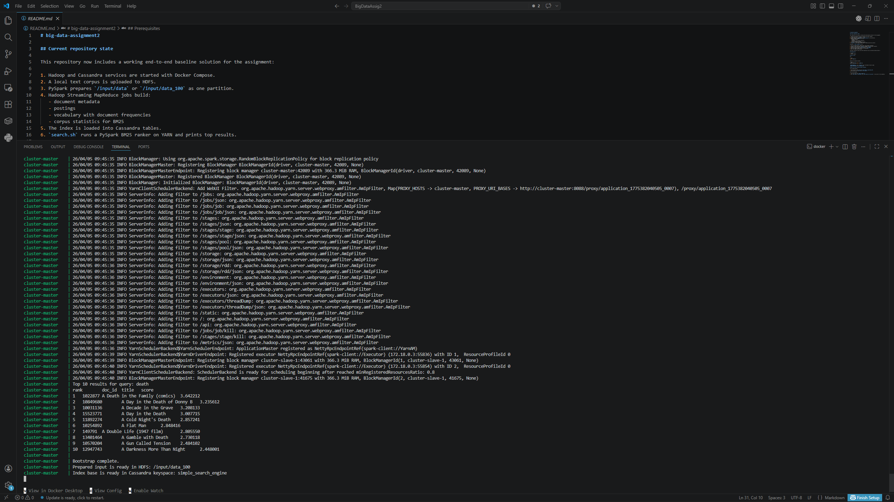
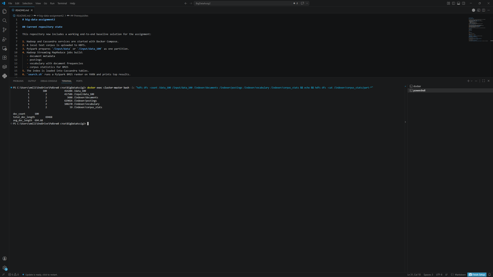
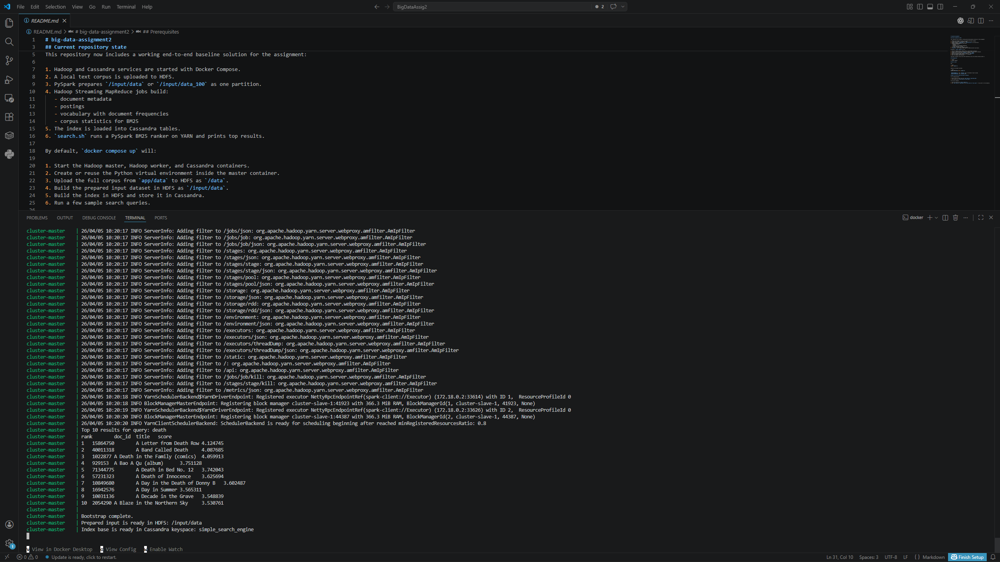
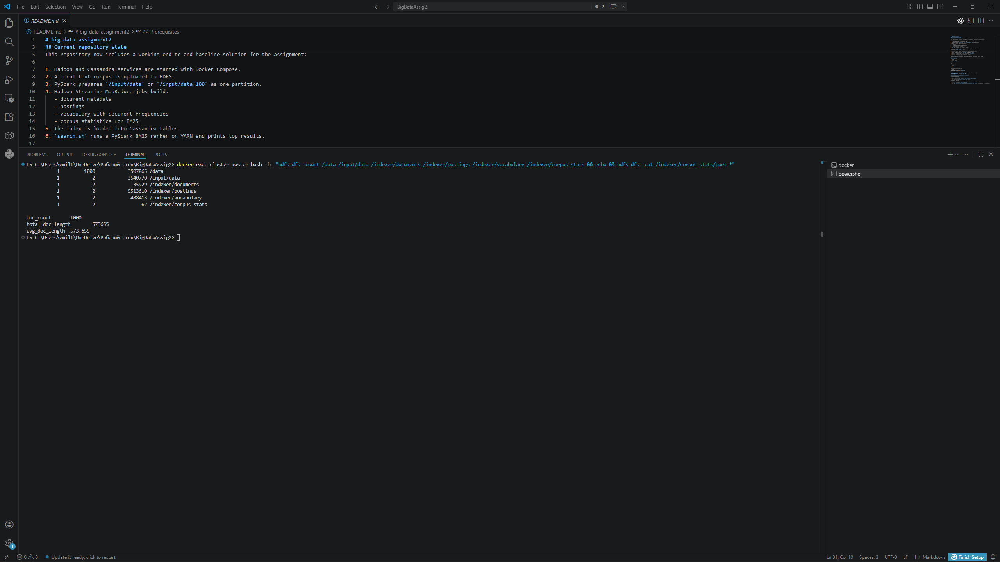

# Assignment 2 Report

## Simple Search Engine using Hadoop MapReduce, Cassandra, and Spark RDD

Course: Big Data - IU

This report presents the implementation of a simple search engine built on top of Hadoop MapReduce, Cassandra, and PySpark RDD. The goal of the assignment was to implement a complete indexing and ranking pipeline for a corpus of plain text documents and to rank documents with BM25 for user queries. The final system supports corpus preparation, distributed index construction, storage of index structures in Cassandra, and query-time ranking with Spark on YARN.

## 1. Methodology

### 1.1 Overall System Design

The final system is organized as an end-to-end pipeline with four major stages:

1. Local plain text documents are uploaded to HDFS.
2. PySpark prepares a normalized one-partition indexing input in HDFS.
3. Hadoop Streaming MapReduce jobs build the search index and corpus statistics.
4. The index is loaded into Cassandra and queried by a Spark-based BM25 ranker.

The repository uses Docker Compose to start the full environment. The main services are:

1. `cluster-master` for Hadoop master services, Spark driver execution, and orchestration.
2. `cluster-slave-1` for distributed Hadoop and Spark execution.
3. `cassandra-server` for persistent storage of the final index.

The repository contains two corpus modes:

1. `app/data_100` is a fixed debug subset of 100 documents. It is used for fast iteration and for the screenshots requested in the assignment.
2. `app/data` is the full corpus of 1000 documents used for the final run.

This separation was intentional. It allowed quick debugging and screenshot collection on 100 documents while still satisfying the final assignment requirement of indexing at least 1000 documents.

### 1.2 Dataset and Document Format

The solution uses a prepared subset of Wikipedia plain text documents. Each document is stored as a UTF-8 text file and follows the required naming convention:

`<doc_id>_<doc_title>.txt`

Examples of valid document names include:

1. `3097302_A_Kurt_Weill_Cabaret.txt`
2. `18167014_A_British_Picture.txt`
3. `34589053_A_Fugitive_from_the_Past.txt`

The document id is taken from the prefix before the first underscore. The remaining part of the filename is treated as the document title. The document body is stored as plain text inside the file. The solution does not depend on XML or JSON files.

For grading stability, the repository ships with the prepared local corpora in `app/data` and `app/data_100`. At the same time, the repository also includes a reproducible parquet-based preparation path. The scripts `prepare_corpus_from_parquet.py` and `prepare_corpus_from_parquet.sh` can read a parquet file with Spark, recreate the local UTF-8 text documents, upload them to HDFS, and continue with the standard indexing preparation flow. This means the repository supports both a ready-to-run text corpus and a formal parquet-to-text data preparation path.

### 1.3 Data Preparation in HDFS with PySpark

The assignment requires a preparation step that creates an HDFS input of the following form:

`<doc_id>    <doc_title>    <doc_text>`

This was implemented with two layers of scripts.

The first layer is optional and reproduces the local text corpus from parquet:

1. `prepare_corpus_from_parquet.sh`
2. `prepare_corpus_from_parquet.py`

`prepare_corpus_from_parquet.sh` performs the following steps:

1. Upload the source parquet file to HDFS.
2. Run a PySpark job that reads the parquet file.
3. Select the `id`, `title`, and `text` columns.
4. Create UTF-8 text files with the required `<doc_id>_<doc_title>.txt` naming format.
5. Store the recreated corpus in a local generated folder.
6. Continue with the standard HDFS preparation flow.

The second layer prepares the HDFS indexing input from the local text corpus:

1. `prepare_data.sh`
2. `prepare_data.py`

`prepare_data.sh` performs the orchestration work:

1. It receives the local corpus folder and the HDFS source and output paths.
2. It deletes old HDFS output if it already exists.
3. It uploads the local corpus into HDFS.
4. It calls `prepare_data.py` with `spark-submit`.

The upload step was implemented in batches instead of calling `hdfs dfs -put` once per file. This change was important for the final full run on 1000 documents because per-file uploads made the bootstrap much slower.

`prepare_data.py` uses PySpark RDD operations:

1. `wholeTextFiles` reads the text files from HDFS.
2. The document filename is parsed into `doc_id` and `doc_title`.
3. Document text is normalized by collapsing repeated whitespace.
4. Invalid or empty records are filtered out.
5. The output is coalesced into one partition and stored in HDFS.

As a result, the prepared indexing input is stored as a single `part-00000` file in:

1. `/input/data_100` for the 100-document debug run
2. `/input/data` for the 1000-document final run

### 1.4 Text Normalization and Tokenization

The same text processing rules are used both during indexing and during query execution. This is important because the search engine would otherwise tokenize documents and queries differently, which would reduce retrieval quality.

The shared logic is implemented in `text_utils.py`:

1. Repeated whitespace is normalized to a single space.
2. All tokens are lowercased.
3. Tokenization uses a Unicode-aware regular expression:
   `[^\W_]+(?:'[^\W_]+)*`
4. Apostrophes inside words are preserved.
5. Underscores are not treated as token characters.

The system intentionally does not use stemming or stop-word removal. This keeps the baseline solution simple, deterministic, and easy to explain. It also stays close to the assignment requirement, which focuses on distributed indexing and ranking rather than advanced NLP preprocessing.

### 1.5 Hadoop Streaming Index Construction

The index is built by `create_index.sh`. The script locates the Hadoop Streaming jar and launches four MapReduce jobs. Each job reads the prepared input file from HDFS and produces one search-related artifact.

The final HDFS index layout is:

1. `/indexer/documents`
2. `/indexer/postings`
3. `/indexer/vocabulary`
4. `/indexer/corpus_stats`

Each output directory is written with a single reducer so the final artifact is stored as one partition. This design simplifies inspection, loading to Cassandra, and report demonstration.

#### Job 1: Document Metadata

`mapper1.py` parses the prepared input and emits:

`doc_id    doc_title    doc_len`

where `doc_len` is the number of tokens in the document body after tokenization.

`reducer1.py` keeps one line per document id. The output of this job is used as the document metadata table.

#### Job 2: Postings

`mapper2.py` parses each prepared record and computes the term frequency (`tf`) of every unique term in the document. For each term it emits:

`term    doc_id    tf    doc_len`

`reducer2.py` forwards the grouped output. This job creates the inverted index postings that are later stored in Cassandra.

#### Job 3: Vocabulary and Document Frequency

`mapper3.py` emits one line per unique term inside each document:

`term    1`

`reducer3.py` sums these values and produces:

`term    df`

where `df` is the document frequency, meaning the number of documents that contain the term.

#### Job 4: Corpus Statistics

`mapper4.py` emits corpus-wide aggregate contributions from each document:

1. `doc_count    1`
2. `total_doc_length    doc_len`

`reducer4.py` sums both values and computes:

1. `doc_count`
2. `total_doc_length`
3. `avg_doc_length`

These statistics are required by BM25 at query time.

### 1.6 Cassandra Schema

The final index is loaded into Cassandra in the keyspace:

`simple_search_engine`

The schema contains four tables.

#### documents

Stores one row per document:

1. `doc_id`
2. `title`
3. `display_title`
4. `doc_len`

`display_title` is simply the human-readable version of the filename title, with underscores replaced by spaces.

#### vocabulary

Stores one row per term:

1. `term`
2. `df`

This table is used to retrieve document frequency values during BM25 scoring.

#### postings

Stores the inverted index:

1. `term`
2. `doc_id`
3. `tf`
4. `doc_len`

The primary key is `(term, doc_id)`, which is a natural access path for query evaluation because the ranker fetches postings by term.

#### corpus_stats

Stores the small set of global values:

1. `doc_count`
2. `total_doc_length`
3. `avg_doc_length`

This table keeps the BM25 corpus parameters available without recomputing them at query time.

### 1.7 Loading the Index into Cassandra

The Cassandra loading step is handled by:

1. `store_index.sh`
2. `app.py`

`store_index.sh` validates that all required HDFS index paths exist and then calls `python app.py load /indexer`.

`app.py` performs the following tasks:

1. Connects to Cassandra, waiting until the service becomes ready.
2. Creates the keyspace and tables if they do not exist.
3. Truncates old tables so the load is repeatable.
4. Streams each HDFS artifact with `hdfs dfs -cat`.
5. Inserts the rows into Cassandra in chunks with prepared statements and concurrent batched execution.

This design keeps the loading logic simple and robust. It also makes the pipeline repeatable without manual cleanup.

### 1.8 Query Processing and BM25 Ranking

The search engine query path is implemented by:

1. `search.sh`
2. `query.py`

`search.sh` runs `query.py` on YARN with `spark-submit` and ships the packed Python virtual environment to executors.

`query.py` performs the ranking process in the following order:

1. Read the input query from CLI arguments or standard input.
2. Tokenize the query with exactly the same rules as the document tokenizer.
3. Fetch `doc_count` and `avg_doc_length` from Cassandra.
4. Fetch `df` values for all query terms from `vocabulary`.
5. Fetch postings for all query terms from `postings`.
6. Parallelize those postings as an RDD in Spark.
7. Compute BM25 contribution per `(term, document)` pair.
8. Sum contributions by document id.
9. Return the top 10 documents by decreasing score.

The implemented BM25 form is:

`score(d, q) = sum over query terms of idf(t) * ((k1 + 1) * tf(t,d)) / (k1 * ((1 - b) + b * dl/avgdl) + tf(t,d))`

with the following hyperparameters:

1. `k1 = 1.5`
2. `b = 0.75`

The ranker also multiplies the contribution by query term frequency so repeated terms in the query receive more weight.

### 1.9 Important Design Choices

Several design decisions were made deliberately:

1. The repository uses four simple MapReduce jobs instead of one complex job. This makes the index artifacts easier to inspect and explain.
2. The full system is repeatable. Running indexing again overwrites HDFS outputs and truncates Cassandra tables.
3. Query-time ranking reads only the postings needed for the query terms. The system does not scan all documents during search.
4. Titles are stored for output only. Ranking is based on document text, not title text.
5. A fixed debug subset of 100 documents was kept in the repository because the assignment explicitly requires screenshots for a 100-document indexing run.

The main limitation of the system is that query processing still collects postings for the query terms before parallel scoring. This is acceptable for a simple academic baseline and keeps the implementation easy to understand.

## 2. Demonstration

### 2.1 Repository Startup

The repository can be started with Docker Compose.

For the final full run:

```bash
docker compose up
```

For the debug run used in the screenshots:

```bash
docker compose down --remove-orphans
DATASET_MODE=debug docker compose up
```

In PowerShell, the debug run can be started as:

```powershell
docker compose down --remove-orphans
$env:DATASET_MODE='debug'
docker compose up
```

The main entrypoint is `app/app.sh`. It starts the Hadoop services, reuses or creates the Python virtual environment, prepares the chosen corpus, runs indexing, loads Cassandra, and executes sample queries.

If a parquet file is available, the same repository can reproduce the local corpus before indexing. For example, if `app/a.parquet` is present, the full run can be started with:

```powershell
$env:PARQUET_INPUT_PATH='/app/a.parquet'
docker compose up
```

and the debug run on 100 recreated documents can be started with:

```powershell
$env:DATASET_MODE='debug'
$env:PARQUET_INPUT_PATH='/app/a.parquet'
docker compose up
```

### 2.2 Debug Demonstration on 100 Documents

The debug scenario exists for two reasons:

1. It satisfies the assignment requirement for screenshots of a successful 100-document indexing run.
2. It provides a smaller and faster environment for validation before scaling to 1000 documents.

#### Figure S01. Successful debug bootstrap

This screenshot shows the successful end-to-end bootstrap for the debug mode. The environment starts correctly, the data is prepared in HDFS, the index is built and loaded, and sample search queries are executed.



#### Figure S02. Successful indexing output for 100 documents

This screenshot is the key indexing proof for the report. It shows the HDFS counts for the raw corpus, the prepared input, and the four index artifacts. It also shows the corpus statistics output including `doc_count = 100`.



#### Figure S03. Debug search for `history`

The `history` query demonstrates that the engine is able to retrieve and rank documents using BM25 instead of just filtering exact matches. The output contains document ids, human-readable titles, and numeric scores.


#### Figure S04. Debug search for `dogs`

The `dogs` query demonstrates another query type with a concrete thematic keyword. The returned documents are ranked by term frequency, document frequency, and document length normalization. Since the engine ranks by document body and not by title, the title alone does not always reveal why the document scored highly. This is expected behavior and not an error.


#### Figure S05. Debug search for `film`

The `film` query demonstrates a different category of term. In this case, the results are especially useful because many Wikipedia articles in the corpus are about movies, TV series, actors, or entertainment-related topics. This makes the retrieval behavior easier to understand visually from the titles alone.


### 2.3 Final Demonstration on 1000 Documents

After validating the system on the 100-document debug subset, the exact same pipeline was executed on the full local corpus of 1000 documents.

The default `docker compose up` command now runs this final mode automatically. This is important because the evaluator is expected to clone the repository and start it with Docker Compose.

#### Figure S06. Successful full bootstrap

This screenshot shows the successful final bootstrap on the full corpus. It confirms that the repository is not limited to the debug subset.



#### Figure S07. HDFS counts and full corpus statistics

This screenshot shows that the final HDFS structures were created correctly for the full run. It also confirms that the corpus statistics were computed for all 1000 documents.



From the verified final run, the following values were produced:

1. `doc_count = 1000`
2. `avg_doc_length = 573.655`
3. `vocabulary size = 42773`
4. `postings count = 252622`

These numbers show that the final full index is substantially larger than the debug index and that the pipeline scales correctly from the 100-document subset to the 1000-document corpus.

#### Figure S08. Full search for `history of music`

The final query `history of music` demonstrates a multi-term search in the full corpus. This is a better test than a single-term query because it verifies that the ranker sums BM25 contributions across several query terms.


### 2.4 Reflections on the Retrieved Results

The retrieved results follow the expected behavior of BM25:

1. Documents are rewarded for containing the query term multiple times.
2. Very common terms are down-weighted through document frequency.
3. Long documents are normalized through document length.
4. Multi-term queries accumulate evidence across multiple terms.

The screenshots also highlight an important interpretation detail. The engine displays only document ids and titles, but the ranking itself is based on the full document text. This means that some retrieved titles may not look obviously related at first glance, especially for short or ambiguous queries. In those cases, the title is only an identifier for a document whose body text matched the query strongly.

This is a normal property of the implemented search engine and is consistent with the assignment, which only requires that the output display document ids and titles.

## 3. Running Guide

The most important commands for using the repository are:

### Debug mode on 100 documents

```powershell
docker compose down --remove-orphans
$env:DATASET_MODE='debug'
docker compose up
```

### Final mode on 1000 documents

```powershell
docker compose down --remove-orphans
Remove-Item Env:DATASET_MODE -ErrorAction SilentlyContinue
docker compose up
```

### Manual indexing from inside the master container

```bash
docker exec -it cluster-master bash
cd /app
bash index.sh /input/data
```

### Manual search from inside the master container

```bash
bash search.sh "history of music"
```

## 4. Conclusion

The final repository implements the complete baseline required by the assignment:

1. Plain text documents are stored with the required filename format.
2. Documents are uploaded to HDFS and converted into a prepared one-partition indexing input with PySpark.
3. Hadoop Streaming MapReduce builds the document metadata, postings, vocabulary, and corpus statistics.
4. Cassandra stores the final index structures.
5. PySpark on YARN computes BM25 and returns the top 10 ranked documents for a query.

The debug run on 100 documents and the final run on 1000 documents both completed successfully. The screenshots included in the PDF report demonstrate successful indexing and successful query execution in both modes. The solution therefore satisfies the functional requirements of the assignment while keeping the implementation transparent and easy to validate.
